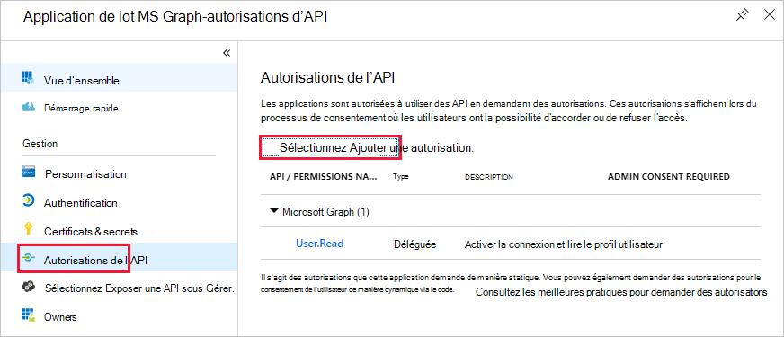

<!-- markdownlint-disable MD002 MD041 -->

Dans cet exercice, vous allez créer une nouvelle application Azure Active Directory qui sera utilisée pour fournir les autorisations déléguées pour le connecteur personnalisé.In this exercise, you will create a new Azure Active Directory Application which will be used to provide the delegated permissions for the custom connector.

Ouvrez un navigateur et accédez au [Centre d’administration Azure Active Directory](https://aad.portal.azure.com).Open a browser and navigate to [Azure Active Directory admin center](https://aad.portal.azure.com). Choisissez le lien **Azure Active Directory** dans le menu de navigation de gauche, puis choisissez l’entrée **inscriptions des applications** dans la section **gérer** du panneau **Azure Active Directory** .Choose the **Azure Active Directory** link in the left navigation menu, then choose the **App registrations** entry in the **Manage** section of the **Azure Active Directory** blade.

Choisissez l’élément de menu **nouvel enregistrement** en haut du panneau **inscriptions des applications** .Choose the **New registration** menu item at the top of the **App Registrations** blade.

Entrez `MS Graph Batch App` dans le champ **nom** .Enter `MS Graph Batch App` in the **Name** field. Dans la section **types de comptes pris en charge** , sélectionnez **comptes dans n’importe quel annuaire d’organisation**.In the **Supported account types** section, select **Accounts in any organizational directory**. Laissez la section **URI de redirection** vide, puis choisissez **inscrire**.Leave the **Redirect URI** section blank and choose **Register**.

Sur le panneau de l’application de **lot MS Graph** , copiez l' **ID d’application (client)**.On the **MS Graph Batch App** blade, copy the **Application (client) ID**. Vous en aurez besoin dans l’exercice suivant.You'll need this in the next exercise.

Choisissez l’entrée des autorisations de l' **API** dans la section **gérer** du panneau d' **application de commandes MS Graph** .Choose the **API permissions** entry in the **Manage** section of the **MS Graph Batch App** blade. Sélectionnez **Ajouter une autorisation** sous **autorisations d’API**.Choose **Add a permission** under **API permissions**.

Dans le panneau **autorisations d’API de demande** , sélectionnez **Microsoft Graph**, puis **autorisations déléguées**.In the **Request API permissions** blade, choose the **Microsoft Graph**, then choose **Delegated permissions**. Recherchez `group` , puis sélectionnez l’autorisation de **lecture et d’écriture de tous les groupes** .Search for `group`, then select the **Read and write all groups** delegated permission. Sélectionnez **Ajouter des autorisations** au bas du panneau.Choose **Add permissions** at the bottom of the blade.

 

Choisissez l’entrée **certificats et secrets** dans la section **gérer** du panneau d' **application de commandes MS Graph** , puis choisissez **nouvelle clé secrète client**.Choose the **Certificates and secrets** entry in the **Manage** section of the **MS Graph Batch App** blade, then choose **New client secret**. Entrez `forever` dans la **Description** et sélectionnez **jamais** sous **expire**.Enter `forever` in the **Description** and select **Never** under **Expires**. Sélectionnez **Ajouter**.Choose **Add**.

Copiez la valeur de la nouvelle clé secrète.Copy the value for the new secret. Vous en aurez besoin dans l’exercice suivant.You'll need this in the next exercise.

> [!IMPORTANT]
> Cette étape est essentielle, car le secret ne sera pas accessible une fois que vous aurez fermé cette Blade.This step is critical as the secret will not be accessible once you close this blade. Enregistrez cette clé secrète dans un éditeur de texte pour l’utiliser dans les exercices à venir.Save this secret to a text editor for use in upcoming exercises.

Pour permettre la gestion des services supplémentaires accessibles via Microsoft Graph, y compris les propriétés Teams, vous devez sélectionner des étendues supplémentaires appropriées pour activer la gestion de services spécifiques.To enable management of additional services accessible via the Microsoft Graph, including Teams properties, you would need to select additional, appropriate scopes to enable managing specific services. Par exemple, pour étendre notre solution afin de créer des blocs-notes ou des plans de planification, des compartiments et des tâches OneNote, vous devez ajouter les étendues d’autorisation requises pour les API pertinentes.For example, to extend our solution to enable creating OneNote Notebooks or Planner plans, buckets and tasks you would need to add the required permission scopes for the relevant APIs.
