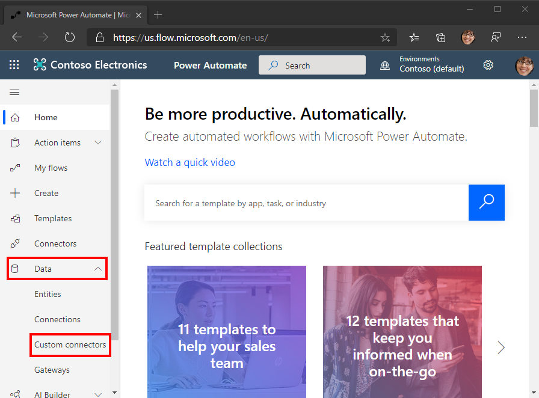
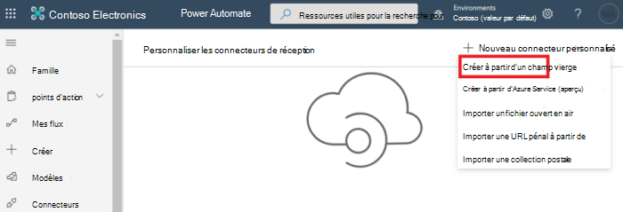
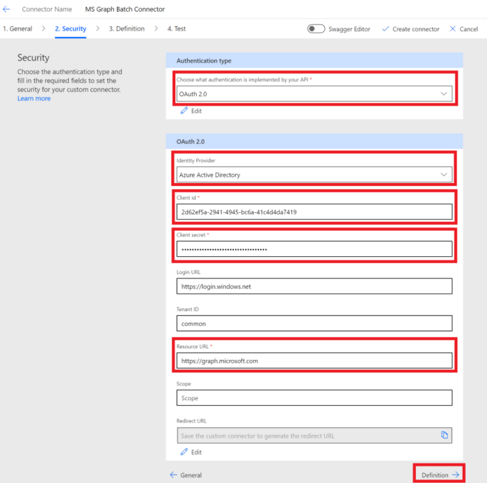
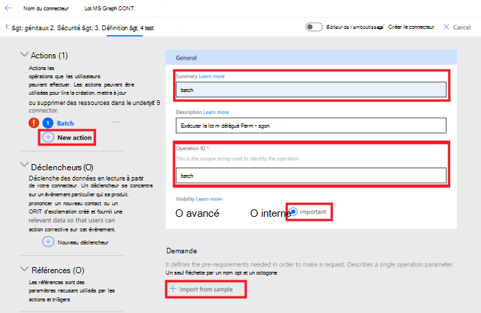

<!-- markdownlint-disable MD002 MD041 -->

Dans cet exercice, vous allez créer un connecteur personnalisé qui peut être utilisé dans Microsoft Power Automated ou dans Azure Logic apps. Le fichier de définition OpenAPI est prédéfini avec le chemin d’accès correct pour le `$batch` point de terminaison Microsoft Graph et les paramètres supplémentaires pour activer l’importation simple.

Il existe deux options pour créer un connecteur personnalisé pour Microsoft Graph :

- Créer à partir d’un champ vierge
- Importer un fichier OpenAPI

## Option 1 : créer un connecteur personnalisé à partir d’un modèle vierge

Ouvrez un navigateur et accédez à [Microsoft Power Automated](https://flow.microsoft.com). Connectez-vous à l’aide de votre compte d’administrateur client Office 365. Choisissez **données** dans le menu de gauche, puis sélectionnez l’élément **connecteurs personnalisés** dans le menu déroulant.

Sur la page **connecteurs personnalisés** , sélectionnez le **nouveau lien connecteur personnalisé** dans le coin supérieur droit, puis sélectionnez **créer à partir d'** un élément vide dans le menu déroulant.

Entrez `MS Graph Batch Connector` dans la zone de texte **nom du connecteur** . Choose **Continue**.

Dans la page configuration **générale** du connecteur, renseignez les champs comme suit.

- **Schéma**: https
- **Hôte**: `graph.microsoft.com`
- **URL de base**: `/`

Cliquez sur le bouton **sécurité** pour continuer.

Dans la page **sécurité** , renseignez les champs comme suit.

- **Choisissez l’authentification qui est implémentée par votre API**: `OAuth 2.0`
- **Fournisseur d’identité**: `Azure Active Directory`
- **ID client**: ID d’application que vous avez créé dans l’exercice précédent
- Clé **secrète client**: la clé que vous avez créée dans l’exercice précédent
- **URL de connexion**: `https://login.windows.net`
- **ID de client**: `common`
- **URL**de la ressource : `https://graph.microsoft.com` (sans finalisation/)
- **Étendue**: laisser vide

Cliquez sur le bouton **définition** pour continuer.

Sur la page **définition** , sélectionnez **nouvelle action** et renseignez les champs comme suit.

- **Résumé**: `Batch`
- **Description**: `Execute Batch with Delegate Permission`
- **ID d’opération**: `Batch`
- **Visibilité**: `important`

Créez une **demande** en sélectionnant **Importer à partir d’un exemple** et renseignez les champs comme suit.

- **Verbe**: `POST`
- **URL** :`https://graph.microsoft.com/v1.0/$batch`
- **En-têtes**: laisser vide
- **Body**: `{}`

Sélectionnez **Importer**.

Sélectionnez **créer un connecteur** en haut à droite. Une fois le connecteur créé, copiez l' **URL de redirection** générée à partir de la page de **sécurité** .

Revenez à l’application inscrite dans le [portail Azure](https://aad.portal.azure.com) que vous avez créé dans l’exercice précédent. Sélectionnez **authentification** dans le menu de gauche. Sélectionnez **Ajouter une plateforme**, puis **Web**. Entrez l’URL de redirection copiée à partir de l’étape précédente dans les **URI de redirection**, puis sélectionnez **configurer**.

## Option 2 : créer un connecteur personnalisé en important un fichier OpenAPI

À l’aide d’un éditeur de texte, créez un fichier vide nommé `MSGraph-Delegate-Batch.swagger.json` et ajoutez le code suivant.

[!code-json]

Ouvrez un navigateur et accédez à [Microsoft Power Automated](https://flow.microsoft.com). Connectez-vous à l’aide de votre compte d’administrateur client Office 365. Choisissez **données** dans le menu de gauche, puis sélectionnez l’élément **connecteurs personnalisés** dans le menu déroulant.

Sur la page **connecteurs personnalisés** , sélectionnez le **nouveau lien connecteur personnalisé** dans le coin supérieur droit, puis sélectionnez Importer un élément de **fichier openapi** dans le menu déroulant.

Entrez `MS Graph Batch Connector` dans la zone de texte **nom du connecteur** . Sélectionnez l’icône de dossier pour télécharger le fichier OpenAPI. Accédez au `MSGraph-Delegate-Batch.swagger.json` fichier que vous avez créé. Choisissez **Continuer** pour charger le fichier openapi.

Sur la page Configuration du connecteur, cliquez sur le lien **sécurité** dans le menu de navigation. Renseignez les champs comme suit.

- **Choisissez l’authentification qui est implémentée par votre API**: `OAuth 2.0`
- **Fournisseur d’identité**: `Azure Active Directory`
- **ID client**: ID d’application que vous avez créé dans l’exercice précédent
- Clé **secrète client**: la clé que vous avez créée dans l’exercice précédent
- **URL de connexion**: `https://login.windows.net`
- **ID de client**: `common`
- **URL**de la ressource : `https://graph.microsoft.com` (sans finalisation/)
- **Étendue**: laisser vide

Sélectionnez **créer un connecteur** en haut à droite. Une fois le connecteur créé, copiez l' **URL de redirection**générée.

Revenez à l’application inscrite dans le [portail Azure](https://aad.portal.azure.com) que vous avez créé dans l’exercice précédent. Sélectionnez **authentification** dans le menu de gauche. Sélectionnez **Ajouter une plateforme**, puis **Web**. Entrez l’URL de redirection copiée à partir de l’étape précédente dans les **URI de redirection**, puis sélectionnez **configurer**.

