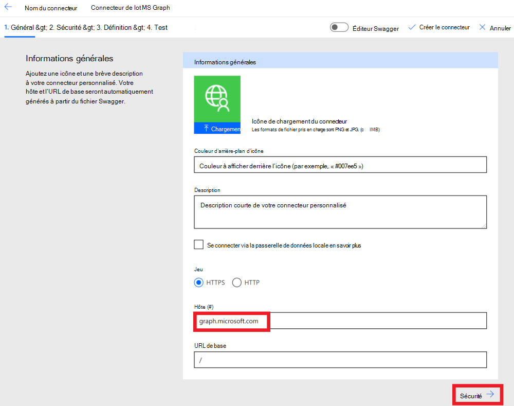
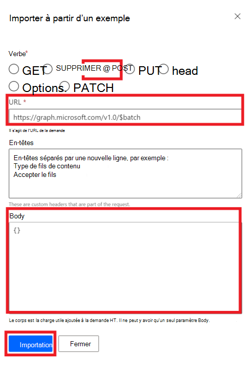

<!-- markdownlint-disable MD002 MD041 -->

Dans cet exercice, vous allez créer un connecteur personnalisé qui peut être utilisé dans Microsoft Power Automated ou dans Azure Logic apps.In this exercise, you will create a new custom connector which can be used in Microsoft Power Automate or in Azure Logic Apps. Le fichier de définition OpenAPI est prédéfini avec le chemin d’accès correct pour le `$batch` point de terminaison Microsoft Graph et les paramètres supplémentaires pour activer l’importation simple.The OpenAPI definition file is prebuilt with the correct path for the Microsoft Graph `$batch` endpoint and additional settings to enable simple import.

Il existe deux options pour créer un connecteur personnalisé pour Microsoft Graph :There are two options to create a custom connector for Microsoft Graph:

- Créer à partir d’un champ viergeCreate from blank
- Importer un fichier OpenAPIImport an OpenAPI file

## Option 1 : créer un connecteur personnalisé à partir d’un modèle viergeOption 1: Create custom connector from blank template

Ouvrez un navigateur et accédez à [Microsoft Power Automated](https://flow.microsoft.com).Open a browser and navigate to [Microsoft Power Automate](https://flow.microsoft.com). Connectez-vous à l’aide de votre compte d’administrateur client Office 365.Sign in with your Office 365 tenant administrator account. Choisissez **données** dans le menu de gauche, puis sélectionnez l’élément **connecteurs personnalisés** dans le menu déroulant.Choose **Data** on the left-hand side menu, and select the **Custom Connectors** item in the drop-down menu.

Sur la page **connecteurs personnalisés** , sélectionnez le **nouveau lien connecteur personnalisé** dans le coin supérieur droit, puis sélectionnez **créer à partir d'** un élément vide dans le menu déroulant.On the **Custom Connectors** page choose the **New custom connector** link in the top right, then select the **Create from blank** item in the drop-down menu.

Entrez `MS Graph Batch Connector` dans la zone de texte **nom du connecteur** .Enter `MS Graph Batch Connector` in the **Connector name** text box. Choose **Continue**.Choose **Continue**.

Dans la page configuration **générale** du connecteur, renseignez les champs comme suit.On the connector configuration **General** page, fill in the fields as follows.

- **Schéma**: https**Scheme**: HTTPS
- **Hôte**: `graph.microsoft.com`**Host**: `graph.microsoft.com`
- **URL de base**: `/`**Base URL**: `/`

Cliquez sur le bouton **sécurité** pour continuer.Choose **Security** button to continue.

Dans la page **sécurité** , renseignez les champs comme suit.On the **Security** page, fill in the fields as follows.

- **Choisissez l’authentification qui est implémentée par votre API**: `OAuth 2.0`**Choose what authentication is implemented by your API**: `OAuth 2.0`
- **Fournisseur d’identité**: `Azure Active Directory`**Identity Provider**: `Azure Active Directory`
- **ID client**: ID d’application que vous avez créé dans l’exercice précédent**Client id**: the application ID you created in the previous exercise
- Clé **secrète client**: la clé que vous avez créée dans l’exercice précédent**Client secret**: the key you created in the previous exercise
- **URL de connexion**: `https://login.windows.net`**Login url**: `https://login.windows.net`
- **ID de client**: `common`**Tenant ID**: `common`
- **URL**de la ressource : `https://graph.microsoft.com` (sans finalisation/)**Resource URL**: `https://graph.microsoft.com` (no trailing /)
- **Étendue**: laisser vide**Scope**: Leave blank

Cliquez sur le bouton **définition** pour continuer.Choose **Definition** button to continue.

Sur la page **définition** , sélectionnez **nouvelle action** et renseignez les champs comme suit.On the **Definition** page, select **New Action** and fill in the fields as follows.

- **Résumé**: `Batch`**Summary**: `Batch`
- **Description**: `Execute Batch with Delegate Permission`**Description**: `Execute Batch with Delegate Permission`
- **ID d’opération**: `Batch`**Operation ID**: `Batch`
- **Visibilité**: `important`**Visibility**: `important`

Créez une **demande** en sélectionnant **Importer à partir d’un exemple** et renseignez les champs comme suit.Create **Request** by selecting **Import from Sample** and fill in the fields as follows.

- **Verbe**: `POST`**Verb**: `POST`
- **URL** :`https://graph.microsoft.com/v1.0/$batch`**URL**: `https://graph.microsoft.com/v1.0/$batch`
- **En-têtes**: laisser vide**Headers**: Leave blank
- **Body**: `{}`**Body**: `{}`

Sélectionnez **Importer**.Select **Import**.

Sélectionnez **créer un connecteur** en haut à droite.Choose **Create Connector** on the top-right. Une fois le connecteur créé, copiez l' **URL de redirection** générée à partir de la page de **sécurité** .After the connector has been created, copy the generated **Redirect URL** from **Security** page.

Revenez à l’application inscrite dans le [portail Azure](https://aad.portal.azure.com) que vous avez créé dans l’exercice précédent.Go back to the registered application in the [Azure Portal](https://aad.portal.azure.com) you created in the previous exercise. Sélectionnez **authentification** dans le menu de gauche.Select **Authentication** on the left-hand side menu. Sélectionnez **Ajouter une plateforme**, puis **Web**.Select **Add a platform**, then select **Web**. Entrez l’URL de redirection copiée à partir de l’étape précédente dans les **URI de redirection**, puis sélectionnez **configurer**.Enter the redirect URL copied from the previous step in the **Redirect URIs**, then select **Configure**.

## Option 2 : créer un connecteur personnalisé en important un fichier OpenAPIOption 2: Create custom connector by importing OpenAPI file

À l’aide d’un éditeur de texte, créez un fichier vide nommé `MSGraph-Delegate-Batch.swagger.json` et ajoutez le code suivant.Using a text editor, create a new empty file named `MSGraph-Delegate-Batch.swagger.json` and add the following code.

[!code-json]

Ouvrez un navigateur et accédez à [Microsoft Power Automated](https://flow.microsoft.com).Open a browser and navigate to [Microsoft Power Automate](https://flow.microsoft.com). Connectez-vous à l’aide de votre compte d’administrateur client Office 365.Sign in with your Office 365 tenant administrator account. Choisissez **données** dans le menu de gauche, puis sélectionnez l’élément **connecteurs personnalisés** dans le menu déroulant.Choose **Data** on the left-hand side menu, and select the **Custom Connectors** item in the drop-down menu.

Sur la page **connecteurs personnalisés** , sélectionnez le **nouveau lien connecteur personnalisé** dans le coin supérieur droit, puis sélectionnez Importer un élément de **fichier openapi** dans le menu déroulant.On the **Custom Connectors** page choose the **New custom connector** link in the top right, then select the **Import an OpenAPI file** item in the drop-down menu.

Entrez `MS Graph Batch Connector` dans la zone de texte **nom du connecteur** .Enter `MS Graph Batch Connector` in the **Connector name** text box. Sélectionnez l’icône de dossier pour télécharger le fichier OpenAPI.Choose the folder icon to upload the OpenAPI file. Accédez au `MSGraph-Delegate-Batch.swagger.json` fichier que vous avez créé.Browse to the `MSGraph-Delegate-Batch.swagger.json` file you created. Choisissez **Continuer** pour charger le fichier openapi.Choose **Continue** to upload the OpenAPI file.

Sur la page Configuration du connecteur, cliquez sur le lien **sécurité** dans le menu de navigation.On the connector configuration page, choose the **Security** link in the navigation menu. Renseignez les champs comme suit.Fill in the fields as follows.

- **Choisissez l’authentification qui est implémentée par votre API**: `OAuth 2.0`**Choose what authentication is implemented by your API**: `OAuth 2.0`
- **Fournisseur d’identité**: `Azure Active Directory`**Identity Provider**: `Azure Active Directory`
- **ID client**: ID d’application que vous avez créé dans l’exercice précédent**Client id**: the application ID you created in the previous exercise
- Clé **secrète client**: la clé que vous avez créée dans l’exercice précédent**Client secret**: the key you created in the previous exercise
- **URL de connexion**: `https://login.windows.net`**Login url**: `https://login.windows.net`
- **ID de client**: `common`**Tenant ID**: `common`
- **URL**de la ressource : `https://graph.microsoft.com` (sans finalisation/)**Resource URL**: `https://graph.microsoft.com` (no trailing /)
- **Étendue**: laisser vide**Scope**: Leave blank

Sélectionnez **créer un connecteur** en haut à droite.Choose **Create Connector** on the top-right. Une fois le connecteur créé, copiez l' **URL de redirection**générée.After the connector has been created, copy the generated **Redirect URL**.

Revenez à l’application inscrite dans le [portail Azure](https://aad.portal.azure.com) que vous avez créé dans l’exercice précédent.Go back to the registered application in the [Azure Portal](https://aad.portal.azure.com) you created in the previous exercise. Sélectionnez **authentification** dans le menu de gauche.Select **Authentication** on the left-hand side menu. Sélectionnez **Ajouter une plateforme**, puis **Web**.Select **Add a platform**, then select **Web**. Entrez l’URL de redirection copiée à partir de l’étape précédente dans les **URI de redirection**, puis sélectionnez **configurer**.Enter the redirect URL copied from the previous step in the **Redirect URIs**, then select **Configure**.

