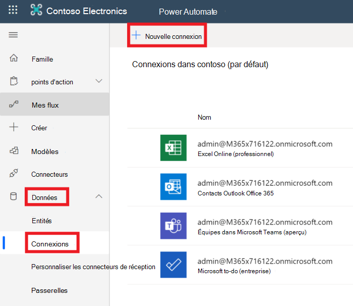
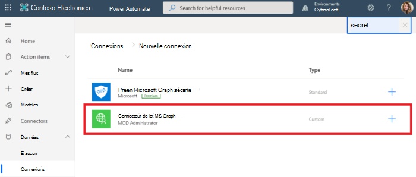
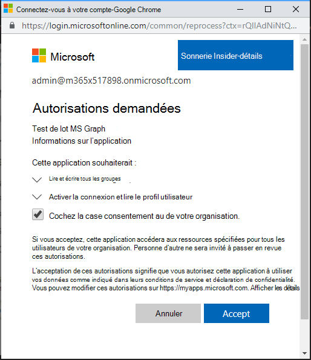

<!-- markdownlint-disable MD002 MD041 -->

L’étape de configuration finale permettant de s’assurer que le connecteur est prêt à être utilisé est d’autoriser et de tester le connecteur personnalisé afin de créer une connexion mise en cache.The final configuration step to ensure the connector is ready for use is to authorize and test the custom connector to create a cached connection.

> [!IMPORTANT]
> Pour suivre les étapes suivantes, vous devez être connecté avec des privilèges d’administrateur.The following steps requires that you are logged in with administrator privileges.

Dans [Microsoft Power automate](https://flow.microsoft.com), accédez à l’élément de menu **données** à gauche et choisissez la page **connexions** .In [Microsoft Power Automate](https://flow.microsoft.com), go to the **Data** menu item on the left and choose the **Connections** page. Sélectionnez le lien **nouvelle connexion** .Choose the **New Connection** link.

Recherchez votre connecteur personnalisé et terminez la connexion en cliquant sur le bouton plus.Find your custom connector and complete the connection by clicking the plus button. Connectez-vous à l’aide de votre compte Azure Active Directory de l’administrateur client Office 365.Sign in with your Office 365 tenant administrator's Azure Active Directory account.

Lorsque vous êtes invité à entrer les autorisations demandées, vérifiez le **consentement au nom de votre organisation** , puis choisissez **accepter** pour autoriser les autorisations.When prompted for the requested permissions, check **Consent on behalf of your organization** and then choose **Accept** to authorize permissions.

Une fois que vous avez autorisé les autorisations, une connexion est créée dans Power automate.After you authorize the permissions, a connection is created in Power Automate.

Le connecteur personnalisé est maintenant configuré et activé.The custom connector is now configured and enabled. Il peut y avoir un retard dans les autorisations appliquées et disponibles, mais le connecteur est maintenant configuré.There may be a delay in permissions being applied and available, but the connector is now configured.
