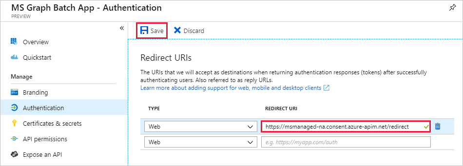

<!-- markdownlint-disable MD002 MD041 -->

Dans cet exercice, vous allez créer un connecteur personnalisé qui peut être utilisé dans le flux ou dans les applications de logique Azure.In this exercise, you will create a new custom connector which can be used in Flow or in Azure Logic Apps. Le fichier de définition de l’API Open est prédéfini avec le chemin d’accès correct `$batch` pour le point de terminaison Microsoft Graph et les paramètres supplémentaires pour activer l’importation simple.The Open API definition file is prebuilt with the correct path for the Microsoft Graph `$batch` endpoint and additional settings to enable simple import.

À l’aide d’un éditeur de texte, créez un `MSGraph-Delegate-Batch.swagger.json` fichier vide nommé et ajoutez le code suivant.Using a text editor, create a new empty file named `MSGraph-Delegate-Batch.swagger.json` and add the following code.

[!code-json]

Ouvrez un navigateur et accédez à [Microsoft Flow](https://flow.microsoft.com).Open a browser and navigate to [Microsoft Flow](https://flow.microsoft.com). Connectez-vous à l’aide de votre compte d’administrateur client Office 365.Sign in with your Office 365 tenant administrator account. Dans le menu de gauche, développez **données** , puis sélectionnez **connecteurs personnalisés**.In the left-hand menu, expand **Data** and choose **Custom connectors**.

Sur la page **connecteurs personnalisés** , sélectionnez le **nouveau lien connecteur personnalisé** dans le coin supérieur droit, puis sélectionnez Importer un élément de **fichier openapi** dans le menu déroulant.On the **Custom connectors** page choose the **New custom connector** link in the top right, then select the **Import an OpenAPI file** item in the drop-down menu. Entrez `MS Graph Batch Connector` dans la zone de texte **nom du connecteur** .Enter `MS Graph Batch Connector` in the **Connector name** text box. Cliquez sur le bouton **Importer** pour télécharger le fichier d’API ouvert.Choose **Import** button to upload the Open API file. Accédez au `MSGraph-Delegate-Batch.swagger.json` fichier que vous avez créé.Browse to the `MSGraph-Delegate-Batch.swagger.json` file you created. Choisissez **Continuer** pour charger le fichier openapi.Choose **Continue** to upload the OpenAPI file.

 

Sur la page Configuration du connecteur, cliquez sur le lien **sécurité** dans le menu de navigation.On the connector configuration page, choose the **Security** link in the navigation menu. Renseignez les champs comme suit.Fill in the fields as follows.

- **Choisissez l’authentification qui est implémentée par votre API**:`OAuth 2.0`**Choose what authentication is implemented by your API**: `OAuth 2.0`
- **Fournisseur d’identité**:`Azure Active Directory`**Identity Provider**: `Azure Active Directory`
- **ID client**: ID d’application que vous avez créé dans l’exercice précédent**Client id**: the application ID you created in the previous exercise
- Clé **secrète client**: la clé que vous avez créée dans l’exercice précédent**Client secret**: the key you created in the previous exercise
- **URL de connexion**:`https://login.windows.net`**Login url**: `https://login.windows.net`
- **ID de client**:`common`**Tenant ID**: `common`
- **URL**de la `https://graph.microsoft.com` ressource : (sans finalisation/)**Resource URL**: `https://graph.microsoft.com` (no trailing /)
- **Étendue**: laisser vide**Scope**: Leave blank

Sélectionnez **créer un connecteur** dans la partie supérieure droite.Choose **Create Connector** on the top-right

Une fois le connecteur créé, copiez l' **URL de redirection**générée.After the connector has been created, copy the generated **Redirect URL**.

Revenez à l’application inscrite dans le [portail Azure](https://aad.portal.azure.com) que vous avez créé dans l’exercice précédent.Go back to the registered application in the [Azure Portal](https://aad.portal.azure.com) you created in the previous exercise. Sélectionnez **vue d’ensemble** sur le panneau de l' **application de lot MS Graph** , puis sélectionnez **Ajouter un URI de redirection**.Select **Overview** on the **MS Graph Batch App** blade, then select **Add a Redirect URI**. Ajoutez l' **URL de redirection** que vous avez copiée dans le champ **URI de redirection** , puis choisissez **Enregistrer**.Add the **Redirect URL** you copied in the **Redirect URI** field and choose **Save**.

