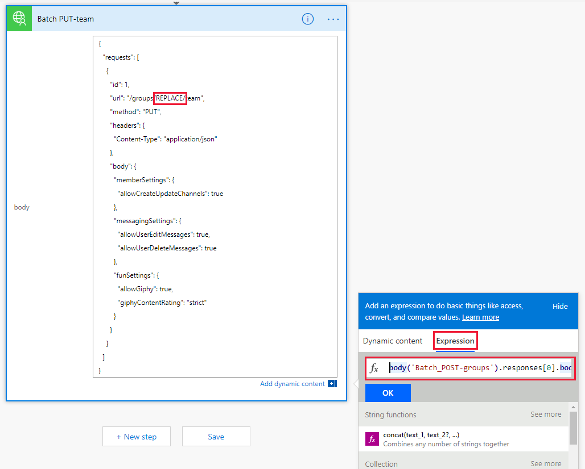

<!-- markdownlint-disable MD002 MD041 -->

<span data-ttu-id="7163b-101">Dans cet exercice, vous allez créer un flux pour utiliser le connecteur personnalisé que vous avez créé dans les exercices précédents pour créer et configurer une équipe Microsoft.</span><span class="sxs-lookup"><span data-stu-id="7163b-101">In this exercise, you will create a Flow to use the custom connector you created in previous exercises to create and configure a Microsoft Team.</span></span> <span data-ttu-id="7163b-102">Le flux utilisera le connecteur personnalisé pour envoyer une requête POST afin de créer un groupe unifié Office 365, sera suspendu pendant un délai pendant la création du groupe, puis enverra une demande PUT pour associer le groupe à une équipe Microsoft.</span><span class="sxs-lookup"><span data-stu-id="7163b-102">The Flow will use the custom connector to send a POST request to create an Office 365 Unified Group, will pause for a delay while the group creation completes, and then will send a PUT request to associate the group with a Microsoft Team.</span></span>

<span data-ttu-id="7163b-103">À la fin, votre flux ressemblera à l'image suivante:</span><span class="sxs-lookup"><span data-stu-id="7163b-103">In the end your Flow will look similar to the following image:</span></span>


<span data-ttu-id="7163b-105">Ouvrez [Microsoft Flow](https://flow.microsoft.com) dans votre navigateur et connectez-vous à l'aide de votre compte d'administrateur client Office 365.</span><span class="sxs-lookup"><span data-stu-id="7163b-105">Open [Microsoft Flow](https://flow.microsoft.com) in your browser and sign in with your Office 365 tenant administrator account.</span></span> <span data-ttu-id="7163b-106">Sélectionnez **mes flux** dans le volet de navigation de gauche.</span><span class="sxs-lookup"><span data-stu-id="7163b-106">Choose **My Flows** in the left-hand navigation.</span></span> <span data-ttu-id="7163b-107">Sélectionnez **nouveau**, puis **créer à partir d'un champ vierge**.</span><span class="sxs-lookup"><span data-stu-id="7163b-107">Choose **New**, then **Create from blank**.</span></span> <span data-ttu-id="7163b-108">Sélectionnez **créer à partir d'un champ vierge**.</span><span class="sxs-lookup"><span data-stu-id="7163b-108">Choose **Create from blank**.</span></span> <span data-ttu-id="7163b-109">Entrez `Manual` dans la zone de recherche et ajoutez le déclencheur **de flux manuellement** .</span><span class="sxs-lookup"><span data-stu-id="7163b-109">Enter `Manual` in the search box and add the **Manually trigger a flow** trigger.</span></span>

<span data-ttu-id="7163b-110">Choisissez **Ajouter une entrée**, sélectionnez **texte** et entrez `Name` comme titre.</span><span class="sxs-lookup"><span data-stu-id="7163b-110">Choose **Add an input**, select **Text** and enter `Name` as the title.</span></span>


<span data-ttu-id="7163b-112">Choisissez **nouvelle étape** et tapez `Batch` dans la zone de recherche.</span><span class="sxs-lookup"><span data-stu-id="7163b-112">Choose **New step** and type `Batch` in the search box.</span></span> <span data-ttu-id="7163b-113">Ajoutez l'action du **connecteur de lot MS Graph** .</span><span class="sxs-lookup"><span data-stu-id="7163b-113">Add the **MS Graph Batch Connector** action.</span></span> <span data-ttu-id="7163b-114">Sélectionnez les points de suspension et renommez `Batch POST-groups`cette action en.</span><span class="sxs-lookup"><span data-stu-id="7163b-114">Choose the ellipsis and rename this action to `Batch POST-groups`.</span></span>

<span data-ttu-id="7163b-115">Ajoutez le code suivant dans la zone de texte **Body** de l'action.</span><span class="sxs-lookup"><span data-stu-id="7163b-115">Add the following code into the **body** text box of the action.</span></span>

```json
{
  "requests": [
    {
      "url": "/groups",
      "method": "POST",
      "id": 1,
      "headers": { "Content-Type": "application/json" },
      "body": {
        "description": "REPLACE",
        "displayName": "REPLACE",
        "groupTypes": ["Unified"],
        "mailEnabled": true,
        "mailNickname": "REPLACE",
        "securityEnabled": false
      }
    }
  ]
}
```

<span data-ttu-id="7163b-116">Remplacez chaque `REPLACE` espace réservé en sélectionnant la `Name` valeur du déclencheur manuel dans le menu Ajouter du **contenu dynamique** .</span><span class="sxs-lookup"><span data-stu-id="7163b-116">Replace each `REPLACE` placeholder by selecting the `Name` value from the manual trigger from the **Add dynamic content** menu.</span></span>


<span data-ttu-id="7163b-118">Choisissez **nouvelle étape**, recherchez `delay` et ajoutez une action de **retard** et configurez pendant 1 minute.</span><span class="sxs-lookup"><span data-stu-id="7163b-118">Choose **New step**, search for `delay` and add a **Delay** action and configure for 1 minute.</span></span>

<span data-ttu-id="7163b-119">Choisissez **nouvelle étape** et tapez `Batch` dans la zone de recherche.</span><span class="sxs-lookup"><span data-stu-id="7163b-119">Choose **New step** and type `Batch` in the search box.</span></span> <span data-ttu-id="7163b-120">Ajoutez l'action du **connecteur de lot MS Graph** .</span><span class="sxs-lookup"><span data-stu-id="7163b-120">Add the **MS Graph Batch Connector** action.</span></span> <span data-ttu-id="7163b-121">Sélectionnez les points de suspension et renommez `Batch PUT-team`cette action en.</span><span class="sxs-lookup"><span data-stu-id="7163b-121">Choose the ellipsis and rename this action to `Batch PUT-team`.</span></span>

<span data-ttu-id="7163b-122">Ajoutez le code suivant dans la zone de texte **Body** de l'action.</span><span class="sxs-lookup"><span data-stu-id="7163b-122">Add the following code into the **body** text box of the action.</span></span>

```json
{
  "requests": [
    {
      "id": 1,
      "url": "/groups/REPLACE/team",
      "method": "PUT",
      "headers": {
        "Content-Type": "application/json"
      },
      "body": {
        "memberSettings": {
          "allowCreateUpdateChannels": true
        },
        "messagingSettings": {
          "allowUserEditMessages": true,
          "allowUserDeleteMessages": true
        },
        "funSettings": {
          "allowGiphy": true,
          "giphyContentRating": "strict"
        }
      }
    }
  ]
}
```

<span data-ttu-id="7163b-123">Sélectionnez l' `REPLACE` espace réservé, puis **expression** dans le volet de contenu dynamique.</span><span class="sxs-lookup"><span data-stu-id="7163b-123">Select the `REPLACE` placeholder, then select **Expression** in the dynamic content pane.</span></span> <span data-ttu-id="7163b-124">Ajoutez la formule suivante dans l' **expression**.</span><span class="sxs-lookup"><span data-stu-id="7163b-124">Add the following formula into the **Expression**.</span></span>

```js
body('Batch_POST-groups').responses[0].body.id
```



<span data-ttu-id="7163b-126">Cette formule spécifie que nous voulons utiliser l'ID de groupe à partir du résultat de la première action.</span><span class="sxs-lookup"><span data-stu-id="7163b-126">This formula specifies that we want to use the group ID from the result of the first action.</span></span>


<span data-ttu-id="7163b-128">Sélectionnez **Enregistrer**, puis flux, puis choisissez **test** pour exécuter le flux.</span><span class="sxs-lookup"><span data-stu-id="7163b-128">Choose **Save**, then Flow and choose **Test** to execute the Flow.</span></span>

> [!TIP]
> <span data-ttu-id="7163b-129">Si vous recevez une erreur telle `The template validation failed: 'The action(s) 'Batch_POST-groups' referenced by 'inputs' in action 'Batch_2' are not defined in the template'`que, l'expression est incorrecte et peut faire référence à une action de flux qu'elle ne trouve pas.</span><span class="sxs-lookup"><span data-stu-id="7163b-129">If you receive an error like `The template validation failed: 'The action(s) 'Batch_POST-groups' referenced by 'inputs' in action 'Batch_2' are not defined in the template'`, the expression is incorrect and likely references a Flow action it cannot find.</span></span> <span data-ttu-id="7163b-130">Vérifiez que le nom de l'action que vous référencez correspond exactement.</span><span class="sxs-lookup"><span data-stu-id="7163b-130">Ensure that the action name you are referencing matches exactly.</span></span>

<span data-ttu-id="7163b-131">Sélectionnez la case d'option **j'exécuterai le déclencheur** , puis sélectionnez **enregistrer le test &**.</span><span class="sxs-lookup"><span data-stu-id="7163b-131">Choose the **I'll perform the trigger** action radio button and choose **Save & Test**.</span></span> <span data-ttu-id="7163b-132">Choisissez **Continuer** dans la boîte de dialogue.</span><span class="sxs-lookup"><span data-stu-id="7163b-132">Choose **Continue** in the dialog.</span></span> <span data-ttu-id="7163b-133">Fournissez un nom sans espaces, puis choisissez **exécuter le flux** pour créer une équipe.</span><span class="sxs-lookup"><span data-stu-id="7163b-133">Provide a name without spaces, and choose **Run flow** to create a Team.</span></span>


<span data-ttu-id="7163b-135">Enfin, cliquez sur le lien **voir activité d'exécution de flux** , puis sélectionnez le flux en cours d'exécution pour afficher le journal d'activité.</span><span class="sxs-lookup"><span data-stu-id="7163b-135">Finally, choose the **See flow run activity** link, then select the running Flow to see the activity log.</span></span>

> [!NOTE]
> <span data-ttu-id="7163b-136">Vous devrez peut-être cliquer sur votre instance de flux en cours d'exécution dans la liste exécuter l'historique pour afficher l'exécution de votre flux.</span><span class="sxs-lookup"><span data-stu-id="7163b-136">You may have to click on your running Flow instance in the Run history list to view your Flow execution.</span></span>

<span data-ttu-id="7163b-137">Une fois le flux terminé, votre groupe et votre équipe Office 365 ont été configurés.</span><span class="sxs-lookup"><span data-stu-id="7163b-137">Once the Flow completes, your Office 365 Group and Team have been configured.</span></span> <span data-ttu-id="7163b-138">Sélectionnez les éléments d'action de traitement par lots pour afficher les résultats des appels de lots JSON.</span><span class="sxs-lookup"><span data-stu-id="7163b-138">Select the Batch action items to view the results of the JSON Batch calls.</span></span> <span data-ttu-id="7163b-139">L' `outputs` `Batch PUT-team` action doit avoir un code d'état de 201 pour une association d'équipe réussie semblable à l'image ci-dessous.</span><span class="sxs-lookup"><span data-stu-id="7163b-139">The `outputs` of the `Batch PUT-team` action should have a status code of 201 for a successful Team association similar to the image below.</span></span>

