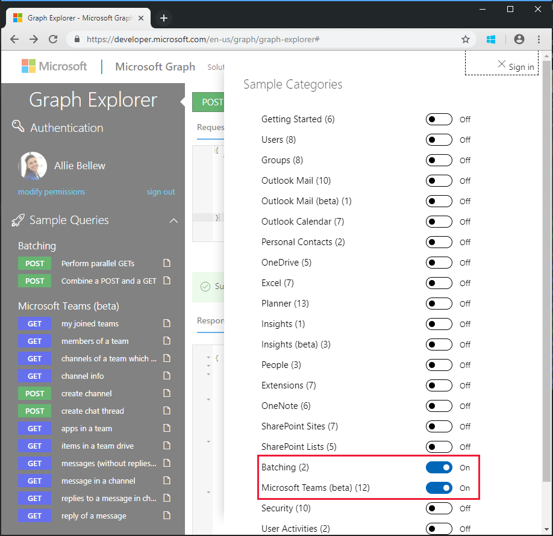
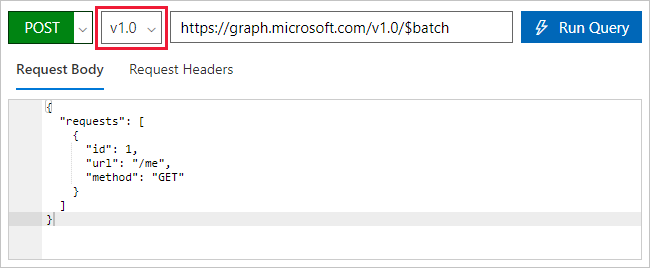
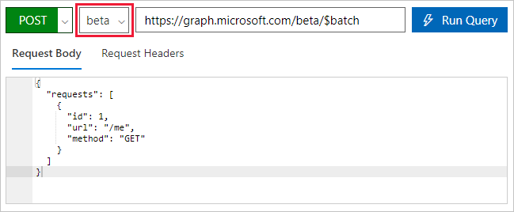

<!-- markdownlint-disable MD002 MD041 -->

<span data-ttu-id="428b9-101">Avant de créer un flux pour consommer le nouveau connecteur, utilisez l' [Explorateur Microsoft Graph](https://developer.microsoft.com/graph/graph-explorer) pour découvrir certaines des fonctionnalités de traitement par lots JSON dans Microsoft Graph.</span><span class="sxs-lookup"><span data-stu-id="428b9-101">Before creating a Flow to consume the new connector, use [Microsoft Graph Explorer](https://developer.microsoft.com/graph/graph-explorer) to discover some of the capabilities and features of JSON batching in Microsoft Graph.</span></span>

<span data-ttu-id="428b9-102">Ouvrez l' [Explorateur Microsoft Graph](https://developer.microsoft.com/graph/graph-explorer) dans votre navigateur.</span><span class="sxs-lookup"><span data-stu-id="428b9-102">Open the [Microsoft Graph Explorer](https://developer.microsoft.com/graph/graph-explorer) in your browser.</span></span> <span data-ttu-id="428b9-103">Connectez-vous à l’aide de votre compte d’administrateur client Office 365.</span><span class="sxs-lookup"><span data-stu-id="428b9-103">Sign in with your Office 365 tenant administrator account.</span></span> <span data-ttu-id="428b9-104">Sélectionnez le lien **afficher d’autres exemples** dans le volet de navigation de gauche, puis faites basculer les exemples pour le **traitement par lots** et **Microsoft Teams (Beta)** **sur activé**.</span><span class="sxs-lookup"><span data-stu-id="428b9-104">Choose the **show more samples** link in the left navigation pane, and toggle the samples for **Batching** and **Microsoft Teams (beta)** to **On**.</span></span>



<span data-ttu-id="428b9-106">Sélectionnez la requête effectuer des exemples de requêtes **parallèles** dans le menu de gauche.</span><span class="sxs-lookup"><span data-stu-id="428b9-106">Select the **Perform parallel GETs** sample query in the left menu.</span></span> <span data-ttu-id="428b9-107">Cliquez sur le bouton **exécuter la requête** en haut à droite de l’écran.</span><span class="sxs-lookup"><span data-stu-id="428b9-107">Choose the **Run Query** button at the top right of the screen.</span></span>

<span data-ttu-id="428b9-108">L’exemple d’opération par lot génère trois requêtes HTTP GET et émet un seul billet HTTP vers `/v1.0/$batch` le point de terminaison Graph.</span><span class="sxs-lookup"><span data-stu-id="428b9-108">The sample batch operation batches three HTTP GET requests and issues a single HTTP POST to the `/v1.0/$batch` Graph endpoint.</span></span>

```json
{
  "requests": [
    {
      "url": "/me?$select=displayName,jobTitle,userPrincipalName",
      "method": "GET",
      "id": "1"
    },
    {
      "url": "/me/messages?$filter=importance eq 'high'&$select=from,subject,receivedDateTime,bodyPreview",
      "method": "GET",
      "id": "2"
    },
    {
      "url": "/me/events",
      "method": "GET",
      "id": "3"
    }
  ]
}
```

<span data-ttu-id="428b9-109">La réponse renvoyée est illustrée ci-dessous.</span><span class="sxs-lookup"><span data-stu-id="428b9-109">The response returned is shown below.</span></span> <span data-ttu-id="428b9-110">Notez le tableau des réponses renvoyées par Microsoft Graph.</span><span class="sxs-lookup"><span data-stu-id="428b9-110">Note the array of responses that is returned by Microsoft Graph.</span></span> <span data-ttu-id="428b9-111">Les réponses aux requêtes par lots peuvent apparaître dans un ordre différent de l’ordre des demandes dans le billet.</span><span class="sxs-lookup"><span data-stu-id="428b9-111">The responses to the batched requests may appear in a different order than the order of the requests in the POST.</span></span> <span data-ttu-id="428b9-112">La `id` propriété doit être utilisée pour corréler les requêtes par lots individuelles avec des réponses par lots spécifiques.</span><span class="sxs-lookup"><span data-stu-id="428b9-112">The `id` property should be used to correlate individual batch requests with specific batch responses.</span></span>

> [!NOTE]
> <span data-ttu-id="428b9-113">La réponse a été tronquée pour des raisons de lisibilité.</span><span class="sxs-lookup"><span data-stu-id="428b9-113">The response has been truncated for readability.</span></span>

```json
{
  "responses": [
    {
      "id": "1",
      "status": 200,
      "headers": {...},
      "body": {...}
    },
    {
      "id": "3",
      "status": 200,
      "headers": {...},
      "body": {...}
    }
    {
      "id": "2",
      "status": 200,
      "headers": {...},
      "body": {...}
    }
  ]
}
```

<span data-ttu-id="428b9-114">Chaque réponse contient une `id`propriété `status`, `headers`,, `body` et.</span><span class="sxs-lookup"><span data-stu-id="428b9-114">Each response contains an `id`, `status`, `headers`, and `body` property.</span></span> <span data-ttu-id="428b9-115">Si la `status` propriété d’une requête indique un échec, le `body` contient toutes les informations d’erreur renvoyées par la demande.</span><span class="sxs-lookup"><span data-stu-id="428b9-115">If the `status` property for a request indicates a failure, the `body` contains any error information returned from the request.</span></span>

<span data-ttu-id="428b9-116">Pour garantir l’ordre des opérations pour les demandes, les requêtes individuelles peuvent être séquencées à l’aide de la propriété [dependsOn](https://docs.microsoft.com/graph/json-batching#sequencing-requests-with-the-dependson-property) .</span><span class="sxs-lookup"><span data-stu-id="428b9-116">To ensure an order of operations for the requests, individual requests can be sequenced using the [dependsOn](https://docs.microsoft.com/graph/json-batching#sequencing-requests-with-the-dependson-property) property.</span></span>

<span data-ttu-id="428b9-117">En plus des opérations de séquencement et de dépendance, le traitement par lots JSON suppose un chemin de base et exécute les requêtes à partir d’un chemin d’accès relatif.</span><span class="sxs-lookup"><span data-stu-id="428b9-117">In addition to sequencing and dependency operations, JSON batching assumes a base path and executes the requests from a relative path.</span></span> <span data-ttu-id="428b9-118">Chaque élément de requête par lot est exécuté à `/v1.0/$batch` partir `/beta/$batch` de l’un des points de terminaison ou, comme spécifié.</span><span class="sxs-lookup"><span data-stu-id="428b9-118">Each batch request element is executed from either the `/v1.0/$batch` OR `/beta/$batch` endpoints as specified.</span></span> <span data-ttu-id="428b9-119">Cela peut avoir des différences importantes, `/beta` car le point de terminaison peut renvoyer une sortie supplémentaire qui ne `/v1.0` peut pas être renvoyée dans le point de terminaison.</span><span class="sxs-lookup"><span data-stu-id="428b9-119">This can have significant differences as the `/beta` endpoint may return additional output which may NOT be returned in the `/v1.0` endpoint.</span></span>

<span data-ttu-id="428b9-120">Par exemple, exécutez les deux requêtes suivantes dans l' [Explorateur Microsoft Graph](https://developer.microsoft.com/graph/graph-explorer).</span><span class="sxs-lookup"><span data-stu-id="428b9-120">For example, execute the following two queries in the [Microsoft Graph Explorer](https://developer.microsoft.com/graph/graph-explorer).</span></span>

1. <span data-ttu-id="428b9-121">Interrogez `/v1.0/$batch` le point de terminaison `/me` à l’aide de l’URL (copie et collage ci-dessous).</span><span class="sxs-lookup"><span data-stu-id="428b9-121">Query the `/v1.0/$batch` endpoint using the url `/me` (copy and paste request below).</span></span>

```json
{
  "requests": [
    {
      "id": 1,
      "url": "/me",
      "method": "GET"
    }
  ]
}
```



<span data-ttu-id="428b9-123">À présent, utilisez la liste déroulante sélecteur de version `beta` pour modifier le point de terminaison, puis faites exactement la même requête.</span><span class="sxs-lookup"><span data-stu-id="428b9-123">Now use the version selector drop-down to change to the `beta` endpoint, and make the exact same request.</span></span>



<span data-ttu-id="428b9-125">Quelles sont les différences entre les résultats renvoyés ?</span><span class="sxs-lookup"><span data-stu-id="428b9-125">What are the differences in the results returned?</span></span> <span data-ttu-id="428b9-126">Essayez d’autres requêtes pour identifier certaines des différences.</span><span class="sxs-lookup"><span data-stu-id="428b9-126">Try some other queries to identify some of the differences.</span></span>

<span data-ttu-id="428b9-127">En plus du contenu de réponse du `/v1.0` et `/beta` des points de terminaison, il est important de comprendre les erreurs possibles lorsqu’une demande de traitement par lots est effectuée pour laquelle le consentement des autorisations n’a pas été accordé.</span><span class="sxs-lookup"><span data-stu-id="428b9-127">In addition to different response content from the `/v1.0` and `/beta` endpoints, it is important to understand the possible errors when a batch request is made for which permission consent has not been granted.</span></span> <span data-ttu-id="428b9-128">Par exemple, voici un élément de demande de lot pour créer un bloc-notes OneNote.</span><span class="sxs-lookup"><span data-stu-id="428b9-128">For example, the following is a batch request item to create a OneNote Notebook.</span></span>

```json
{
  "id": 1,
  "url": "/groups/65c5ecf9-3311-449c-9904-29a2c76b9a50/onenote/notebooks",
  "headers": {
    "Content-Type": "application/json"
  },
  "method": "POST",
  "body": {
    "displayName": "Meeting Notes"
  }
}
```

<span data-ttu-id="428b9-129">Toutefois, si les autorisations de création de bloc-notes OneNote n’ont pas été accordées, la réponse suivante est reçue.</span><span class="sxs-lookup"><span data-stu-id="428b9-129">However, if the permissions to create OneNote Notebooks has not been granted, the following response is received.</span></span> <span data-ttu-id="428b9-130">Notez le code `403 (Forbidden)` d’État et le message d’erreur indiquant que le jeton OAuth fourni n’inclut pas les étendues requises pour effectuer l’action demandée.</span><span class="sxs-lookup"><span data-stu-id="428b9-130">Note the status code `403 (Forbidden)` and the error message which indicates the OAuth token provided does not include the scopes required to completed the requested action.</span></span>

```json
{
  "responses": [
    {
      "id": "1",
      "status": 403,
      "headers": {
        "Cache-Control": "no-cache"
      },
      "body": {
        "error": {
          "code": "40004",
          "message": "The OAuth token provided does not have the necessary scopes to complete the request.
            Please make sure you are including one or more of the following scopes: Notes.ReadWrite.All,
            Notes.Read.All (you provided these scopes: Group.Read.All,Group.ReadWrite.All,User.Read,User.Read.All)",
          "innerError": {
            "request-id": "92d50317-aa06-4bd7-b908-c85ee4eff0e9",
            "date": "2018-10-17T02:01:10"
          }
        }
      }
    }
  ]
}
```

<span data-ttu-id="428b9-131">Chaque demande de votre lot renverra un code d’État, des résultats ou des informations d’erreur.</span><span class="sxs-lookup"><span data-stu-id="428b9-131">Each request in your batch will return a status code and results or error information.</span></span> <span data-ttu-id="428b9-132">Vous devez traiter chacune des réponses afin de déterminer la réussite ou l’échec des opérations de traitement par lots individuels.</span><span class="sxs-lookup"><span data-stu-id="428b9-132">You must process each of the responses in order to determine success or failure of the individual batch operations.</span></span>
