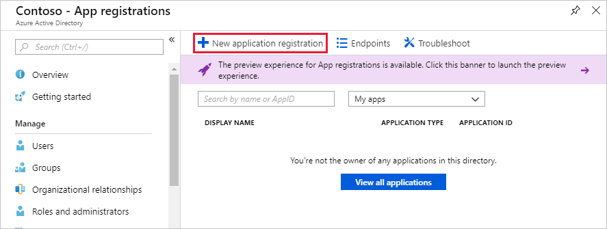

<!-- markdownlint-disable MD002 MD041 -->

Dans cet exercice, vous allez créer une nouvelle application Azure Active Directory qui sera utilisée pour fournir les autorisations déléguées pour le connecteur personnalisé.

Ouvrez un navigateur et accédez au [Centre d’administration Azure Active Directory](https://aad.portal.azure.com). Choisissez le lien **Azure Active Directory** dans le menu de navigation de gauche, puis choisissez l’entrée **inscriptions des applications** dans la section **gérer** du panneau **Azure Active Directory** .

Choisissez l’élément de menu **nouvel enregistrement d’application** en haut du panneau **inscriptions des applications** .

Entrez `MS Graph Batch App` dans le champ **nom** , puis `https://localhost.com/$batch` dans le champ **URL de connexion** , choisissez **créer**.

Sur la page de l’application de **lot MS Graph** , copiez l' **ID d’application** de l’application. Vous en aurez besoin dans l’exercice suivant.

Choisissez l’engrenage de **paramètres** sous le nom de l’application, puis choisissez l’élément de menu **autorisations requises** dans le panneau Paramètres. Sélectionnez **Ajouter** en haut du panneau **autorisations requises** .

Sélectionnez l’option **Sélectionner une API** dans le panneau **Ajouter un accès à l’API** , puis sélectionnez l’élément **Microsoft Graph** et choisissez **Sélectionner** en bas du panneau.

Sur le panneau **activer l’accès** , faites défiler jusqu’à la section **autorisations déléguées** . Sélectionnez l’autorisation déléguée **lire et écrire tous les groupes** , puis choisissez **Sélectionner** en bas du panneau. Sélectionnez **opération** en bas du panneau **Ajouter un accès** à l’API.

 

Sélectionnez l’élément de menu **clés** sur le panneau **paramètres** . Entrez `forever` dans la **Description** de la clé et sélectionnez **ne** pas expirer dans le menu déroulant **durée** . Sélectionnez **Enregistrer** en haut du panneau de **clés** . Copiez la valeur de clé de la nouvelle clé. Vous en aurez besoin dans l’exercice suivant.

> [!IMPORTANT]
> Cette étape est essentielle, car la clé ne sera pas accessible une fois que vous aurez fermé cette Blade. Enregistrez cette clé dans un éditeur de texte pour l’utiliser dans les exercices à venir.

Pour permettre la gestion des services supplémentaires accessibles via Microsoft Graph, y compris les propriétés Teams, vous devez sélectionner des étendues supplémentaires appropriées pour activer la gestion de services spécifiques. Par exemple, pour étendre notre solution afin de créer des blocs-notes ou des plans de planification, des compartiments et des tâches OneNote, vous devez ajouter les étendues d’autorisation requises pour les API pertinentes.