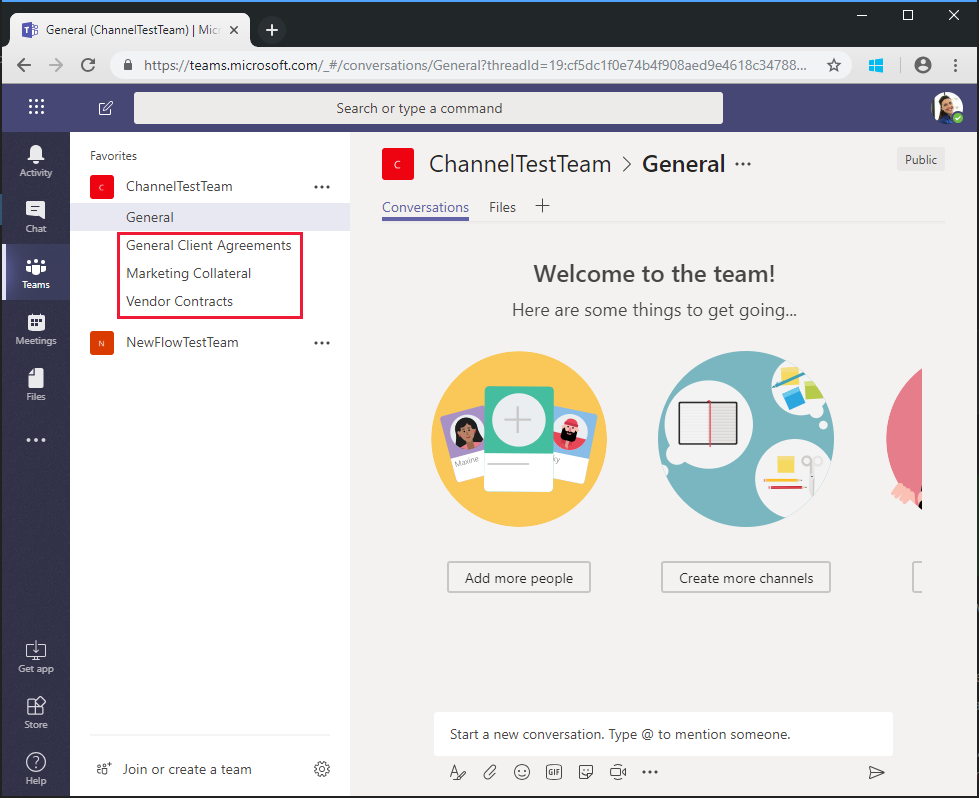

<!-- markdownlint-disable MD002 MD041 -->

Le flux que vous avez créé au cours de l' `$batch` exercice précédent utilise l’API pour effectuer deux requêtes individuelles à Microsoft Graph. Le fait `$batch` d’appeler le point de terminaison de cette façon offre des avantages et une flexibilité `$batch` , mais la véritable puissance du point de terminaison est fournie lors de `$batch` l’exécution de plusieurs demandes vers Microsoft Graph en un seul appel. Dans cet exercice, vous allez étendre l’exemple de création d’un groupe unifié et associer une équipe pour inclure la création de plusieurs canaux par défaut pour l’équipe `$batch` en une seule requête.

Ouvrez [Microsoft Flow](https://flow.microsoft.com) dans votre navigateur et connectez-vous à l’aide de votre compte d’administrateur client Office 365. Sélectionnez le flux que vous avez créé à l’étape précédente, puis cliquez sur **modifier**.

Choisissez **nouvelle étape** et tapez `Batch` dans la zone de recherche. Ajoutez l’action du **connecteur de lot MS Graph** . Sélectionnez les points de suspension et renommez `Batch POST-channels`cette action en.

Ajoutez le code suivant dans la zone de texte **Body** de l’action.

```json
{
  "requests": [
    {
      "id": 1,
      "url": "/teams/REPLACE/channels",
      "headers": {
        "Content-Type": "application/json"
      },
      "method": "POST",
      "body": {
        "displayName": "Marketing Collateral",
        "description": "Marketing collateral and documentation."
      }
    },
    {
      "id": 2,
      "dependsOn": [
        "1"
      ],
      "url": "/teams/REPLACE/channels",
      "headers": {
        "Content-Type": "application/json"
      },
      "method": "POST",
      "body": {
        "displayName": "Vendor Contracts",
        "description": "Vendor documents, contracts, agreements and schedules."
      }
    },
    {
      "id": 3,
      "dependsOn": [
        "2"
      ],
      "url": "/teams/REPLACE/channels",
      "headers": {
        "Content-Type": "application/json"
      },
      "method": "POST",
      "body": {
        "displayName": "General Client Agreements",
        "description": "General Client documents and agreements."
      }
    }
  ]
}
```

Notez que les trois requêtes ci-dessus utilisent la propriété [dependsOn](https://docs.microsoft.com/graph/json-batching#sequencing-requests-with-the-dependson-property) pour spécifier un ordre séquentiel et chacune exécutera une requête post pour créer un nouveau canal dans la nouvelle équipe.

Sélectionnez chaque instance de l' `REPLACE` espace réservé, puis **expression** dans le volet de contenu dynamique. Ajoutez la formule suivante dans l' **expression**.

```js
body('Batch_PUT-team').responses[0].body.id
```


Sélectionnez **Enregistrer**, puis **tester** pour exécuter le flux. Sélectionnez la case d’option **j’exécuterai le déclencheur** , puis choisissez **Enregistrer & test**. Entrez un nom de groupe unique dans le champ **nom** sans espaces, puis choisissez **exécuter le flux** pour exécuter le flux.


Une fois le flux démarré, cliquez sur le lien **voir activité d’exécution de flux** , puis choisissez le flux en cours d’exécution pour afficher le journal d’activité.

Une fois le flux terminé, la sortie finale de l' `Batch POST-channels` action est associée à une réponse d’état http 201 pour chaque canal créé.


Accédez à [Microsoft teams](https://teams.microsoft.com) et connectez-vous à l’aide de votre compte d’administrateur client Office 365. Vérifiez que l’équipe que vous venez de créer apparaît et inclut les trois canaux créés `$batch` par la demande.



Bien que l' `Batch POST-channels` action ci-dessus ait été implémentée dans ce didacticiel séparément, les appels de création des canaux auraient pu être ajoutés comme appels supplémentaires `Batch PUT-team` dans l’action. Cela aurait créé l’équipe et tous les canaux dans un seul appel de lot. Donnez-lui votre choix.

Enfin, n’oubliez pas que les appels de [traitement par lots JSON](https://docs.microsoft.com/graph/json-batching) renvoient un code d’état HTTP pour chaque demande. Dans un processus de production, vous souhaiterez peut-être combiner post-traitement des [`Apply to each`](https://docs.microsoft.com/flow/apply-to-each) résultats avec une action et valider chaque réponse a un code d’État 201 ou compenser tous les autres codes d’état reçus.